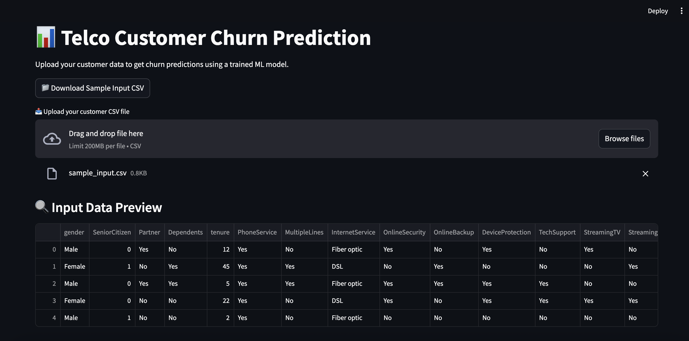
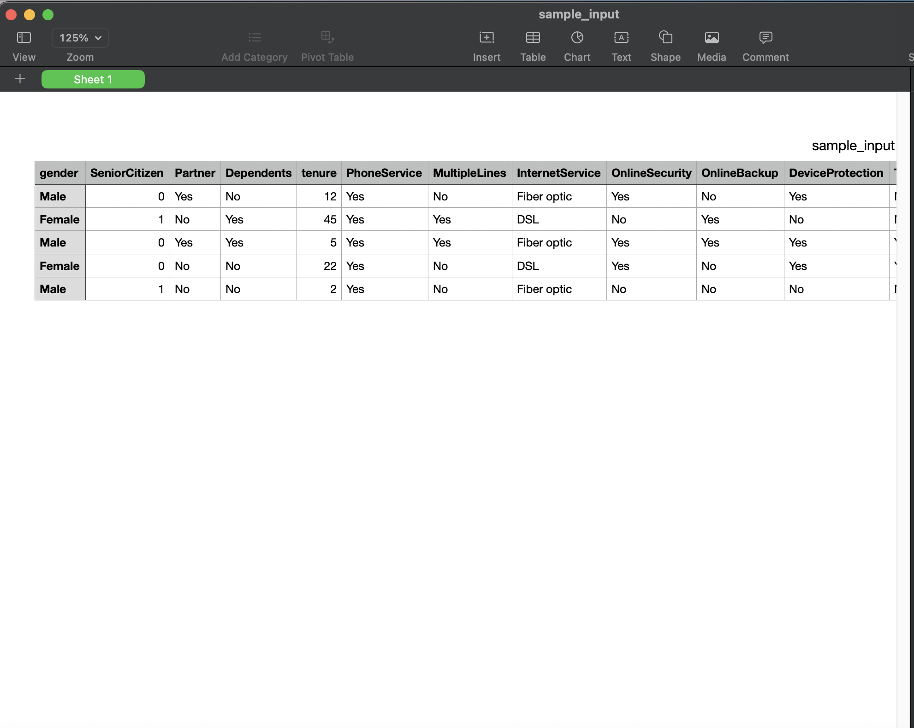
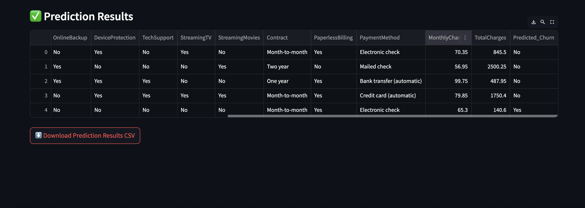
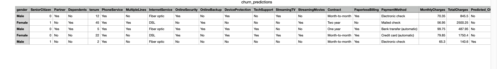

# Telco Customer Churn Prediction 🔥

An end-to-end machine learning project that predicts customer churn for a telecom company, complete with a deployed Streamlit web app.

## 🚀 Features
- Data Preprocessing with `ColumnTransformer`
- Trained RandomForestClassifier Pipeline
- Model exported via `joblib`
- Streamlit web app with CSV upload/download
- Clean UI + prediction results with export

## 🛠️ Tech Stack
- Python, pandas, scikit-learn
- Streamlit
- Jupyter Notebook
- Git, GitHub

## 📸 Screenshots
_Add UI screenshots from the browser here_

## 🧪 Run Locally
```bash
cd streamlit_app
streamlit run app.py

pip install -r requirements.txt
├── notebooks/
├── outputs/
├── streamlit_app/
├── data/
├── README.md
├── requirements.txt

## 📸 Screenshots

### 1. App Homepage


### 2. Sample CSV Uploaded


### 3. Prediction Results Displayed


### 4. Download Prediction CSV
